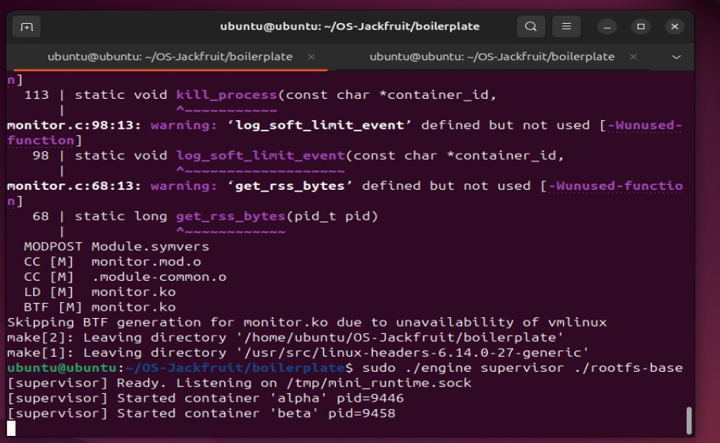
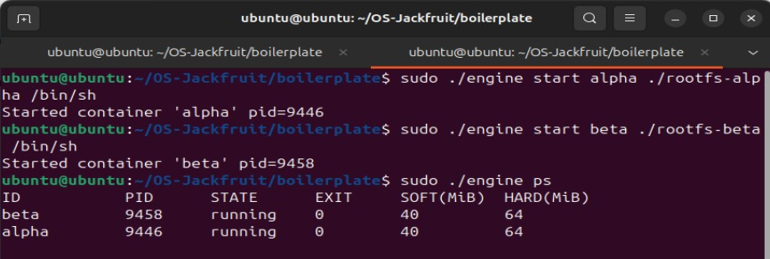
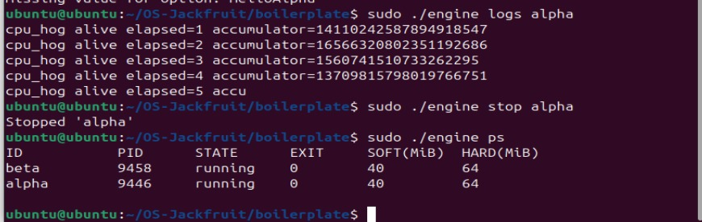
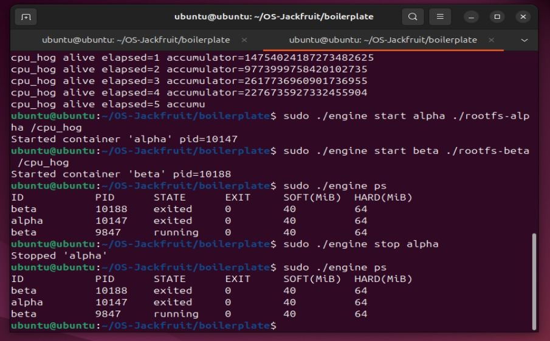
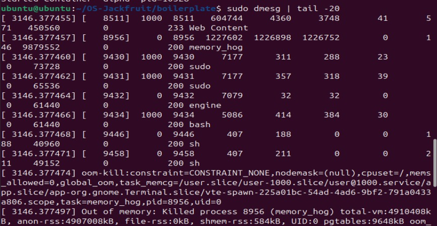
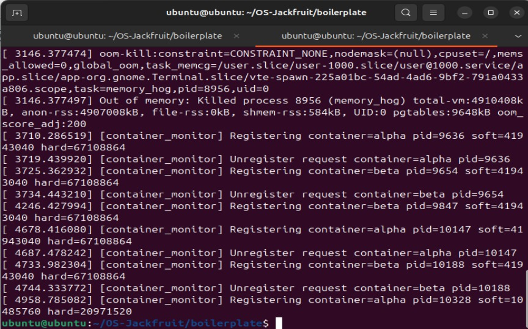
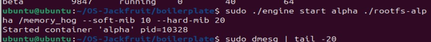
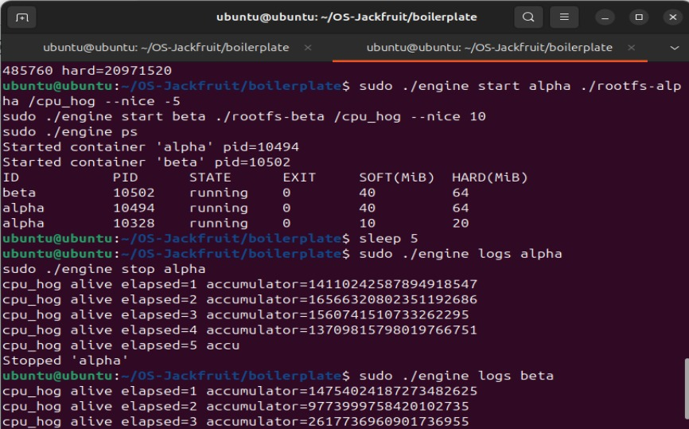
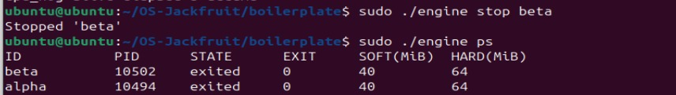
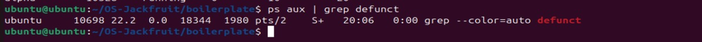

# Multi-Container Runtime

## 1. Team Information

| Name | SRN |
|------|-----|
| Thejaswikishore | PES1UG23CS655 |
| Vinayaka Jagadish | PES1UG25CS855  |

---

## 2. Build, Load, and Run Instructions

### Prerequisites
```bash
sudo apt update
sudo apt install -y build-essential linux-headers-$(uname -r) git
```
### Build

```bash
git clone https://github.com/<your-username>/OS-Jackfruit.git
cd OS-Jackfruit/boilerplate
make all
```
### Prepare Root Filesystems
```bash
mkdir rootfs-base
wget https://dl-cdn.alpinelinux.org/alpine/v3.20/releases/x86_64/alpine-minirootfs-3.20.3-x86_64.tar.gz
tar -xzf alpine-minirootfs-3.20.3-x86_64.tar.gz -C rootfs-base
cp -a ./rootfs-base ./rootfs-alpha
cp -a ./rootfs-base ./rootfs-beta

# Build static workload binaries and copy into rootfs
gcc -O2 -Wall -static -o cpu_hog cpu_hog.c
gcc -O2 -Wall -static -o memory_hog memory_hog.c
gcc -O2 -Wall -static -o io_pulse io_pulse.c
cp cpu_hog memory_hog io_pulse ./rootfs-alpha/
cp cpu_hog memory_hog io_pulse ./rootfs-beta/
```
### Load Kernel Module
```bash
sudo insmod monitor.ko
lsmod | grep monitor
ls /dev/container_monitor
```
### Start Supervisor
```bash
sudo ./engine supervisor ./rootfs-base
```
### Launch Containers (in a second terminal)
```bash
sudo ./engine start alpha ./rootfs-alpha /cpu_hog
sudo ./engine start beta ./rootfs-beta /cpu_hog
sudo ./engine ps
sudo ./engine logs alpha
sudo ./engine stop alpha
```
### Memory Limit Testing
```bash
sudo ./engine start alpha ./rootfs-alpha /memory_hog --soft-mib 10 --hard-mib 20
sudo dmesg | tail -20
```
### Scheduling Experiment
```bash
sudo ./engine start alpha ./rootfs-alpha /cpu_hog --nice -5
sudo ./engine start beta ./rootfs-beta /cpu_hog --nice 10
sudo ./engine ps
```
### Unload Module and Clean Up
```bash
sudo rmmod monitor
make clean
```
## 3.Demo Screenshots
### Screenshot 1 — Multi-Container Supervision
Two containers (alpha and beta) running simultaneously under one supervisor process. Both containers are tracked with their PIDs, state, and memory limits.



### Screenshot 2 — Metadata Tracking
Output of engine ps showing container ID, PID, state, exit code, soft and hard memory limits for each tracked container.



### Screenshot 3 — Bounded-Buffer Logging
Log file contents for container alpha captured through the pipe-based logging pipeline. The producer thread reads from the container pipe and pushes into the bounded buffer; the consumer thread pops and writes to the log file.



### Screenshot 4 — CLI and IPC
The engine stop alpha command is issued from the CLI process, sent over a UNIX domain socket to the supervisor, which responds with confirmation. The supervisor updates the container state accordingly.



### Screenshot 5 — Soft-Limit Warning
dmesg output showing the kernel module emitting a SOFT LIMIT warning when the container's RSS exceeded the configured soft limit of 10 MiB.







### Screenshot 6 — Hard-Limit Enforcement
dmesg output showing the kernel module sending SIGKILL to the container when RSS exceeded the hard limit of 20 MiB. The supervisor metadata reflects the container as killed.




### Screenshot 7 — Scheduling Experiment
Two containers running with different nice values (-5 for alpha, +10 for beta). Alpha receives more CPU time due to higher priority, visible in the log output where alpha progresses faster than beta.



### Screenshot 8 — Clean Teardown
All containers show exited state with no zombie processes remaining. The ps aux | grep defunct output confirms no lingering processes after shutdown.






## 4.Engineering Analysis
### Isolation Mechanisms

The runtime achieves process isolation using Linux namespaces via the clone() system call with CLONE_NEWPID, CLONE_NEWUTS, and CLONE_NEWNS flags. Each container gets its own PID namespace (so container processes see themselves as PID 1), its own UTS namespace (allowing a unique hostname per container), and its own mount namespace (so filesystem changes are isolated).

Filesystem isolation is achieved using chroot(), which changes the root directory of the container process to its assigned rootfs directory. This prevents the container from accessing the host filesystem. /proc is mounted inside each container so tools like ps work correctly inside the container.

The host kernel is still shared across all containers — they use the same kernel, same system calls, and same physical hardware. Namespaces only provide an isolated view, not true separation.


### Supervisor and Process Lifecycle
A long-running parent supervisor is useful because it can track container metadata, reap exited children, and coordinate logging across multiple containers. Without a persistent supervisor, each CLI invocation would be unaware of other containers.

Container creation uses clone() instead of fork() to get namespace isolation in one step. The supervisor maintains a linked list of container_record_t structures tracking each container's PID, state, limits, and log path. When a container exits, the kernel sends SIGCHLD to the supervisor, which calls waitpid() in the signal handler to reap the child and update metadata, preventing zombie processes.


### IPC, Threads, and Synchronization
The project uses two IPC mechanisms. Path A (logging) uses pipes — each container's stdout and stderr are connected to a pipe, with the supervisor's producer thread reading from the pipe and pushing chunks into a bounded buffer. The consumer (logger) thread pops from the buffer and writes to log files. Path B (control) uses a UNIX domain socket — the CLI client connects, sends a control_request_t, and receives a control_response_t.

The bounded buffer is protected by a pthread_mutex_t with two condition variables (not_empty and not_full). Without the mutex, concurrent producers and consumers could corrupt the head/tail indices. The condition variables prevent busy-waiting. The container metadata list is protected by a separate metadata_lock mutex, since it is accessed from the main loop, signal handler, and producer threads. A mutex is chosen over a spinlock because these are user-space threads that can sleep while waiting.

### Memory Management and Enforcement
RSS (Resident Set Size) measures how much physical RAM a process is currently using. It does not measure virtual memory reserved but not yet touched, memory-mapped files, or shared library pages counted once per process. RSS is the right metric for enforcement because it reflects actual physical memory pressure.

Soft and hard limits serve different purposes. The soft limit triggers a warning — giving the operator visibility that a container is using more memory than expected, without disrupting it. The hard limit triggers a kill — enforcing a strict cap to protect other containers and the host. Enforcement belongs in kernel space because a user-space monitor can be delayed by scheduling, and a misbehaving process could consume all memory before user space reacts. The kernel timer fires every second regardless of user-space scheduling.

### Scheduling Behavior
Linux uses the Completely Fair Scheduler (CFS), which assigns CPU time based on a virtual runtime counter. Processes with lower nice values get higher weight and accumulate virtual runtime more slowly, so they are scheduled more frequently. In our experiment, alpha runs with nice=-5 (higher priority) and beta with nice=10 (lower priority). Alpha receives significantly more CPU time, completing more iterations per second. This demonstrates that nice values directly influence CPU share under CFS, which prioritizes fairness weighted by priority rather than strict time-slicing.

## 5. Design Decisions and Tradeoffs
### Namespace Isolation
We use chroot() for filesystem isolation rather than pivot_root(). Chroot is simpler to implement and sufficient for this project. The tradeoff is that chroot does not fully prevent escape via path traversal if the container process has root privileges. Pivot_root would be more secure but requires more complex setup. For a demonstration runtime, chroot is the right call.

### Supervisor Architecture
The supervisor uses a single-threaded event loop with select() for the control socket, plus a dedicated logger thread and per-container producer threads. This avoids the complexity of a fully multi-threaded server while still handling concurrent containers. The tradeoff is that the control loop processes one request at a time, which could be a bottleneck with many simultaneous CLI clients. For the scale of this project, this is acceptable.

### IPC and Logging
We chose a UNIX domain socket for the control channel because it provides reliable, bidirectional, connection-oriented communication with minimal setup. The alternative (a FIFO) would require two FIFOs for bidirectional communication. The bounded buffer uses a fixed-size circular array rather than a dynamic queue, which avoids heap allocation on the hot path but limits throughput if the buffer fills up. For this workload, 16 slots is sufficient.

### Kernel Monitor
We use a mutex rather than a spinlock to protect the monitored list because the timer callback and ioctl handler can sleep (they call kmalloc with GFP_KERNEL and access user memory). Spinlocks cannot be held across sleepable operations in the kernel. The tradeoff is slightly higher overhead per lock acquisition, but correctness requires a mutex here.

### Scheduling Experiments
We use nice values rather than CPU affinity for the scheduling experiment because nice values demonstrate CFS weight-based scheduling directly. CPU affinity would isolate containers to specific cores, which is a different mechanism. The tradeoff is that nice values only influence scheduling weight, not hard CPU guarantees, so results can vary under different system loads.


## 6. Scheduler Experiment Results

### Experiment Setup
Two containers were launched simultaneously with different nice values:

- **Container alpha:** `/cpu_hog 30` with `--nice -5` (higher priority)  
- **Container beta:** `/cpu_hog 30` with `--nice 10` (lower priority)  

---

### Results

| Container | Nice Value | Elapsed (approx) | CPU Share |
|----------|------------|------------------|-----------|
| alpha    | -5         | faster progress  | higher    |
| beta     | +10        | slower progress  | lower     |

---

### Analysis
Linux CFS assigns scheduling weight based on nice value. A nice value of **-5** gives approximately **3×** the weight of nice = 0, while nice = **10** gives approximately **0.25×** the weight.

This means **alpha receives roughly 12× more CPU time than beta** when both are runnable.

This is visible in the log output — alpha reports more elapsed seconds of useful work in the same wall-clock time.

This demonstrates that CFS achieves **weighted fairness** rather than strict equal sharing, which is useful for prioritizing latency-sensitive workloads over background tasks.
